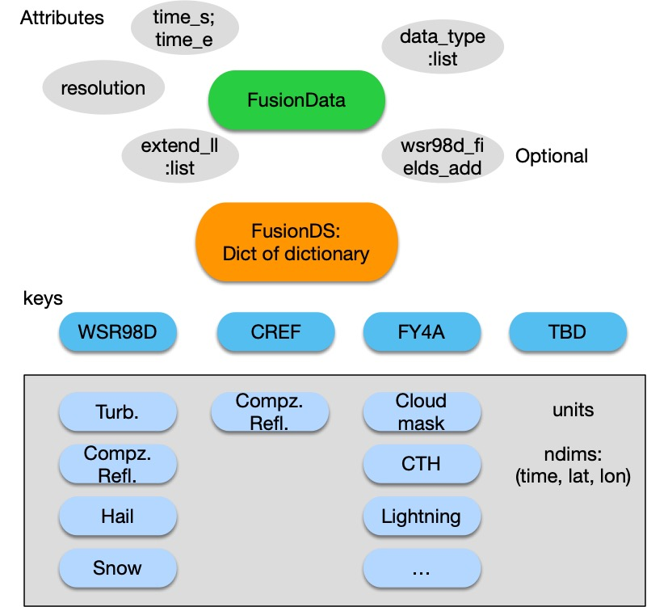
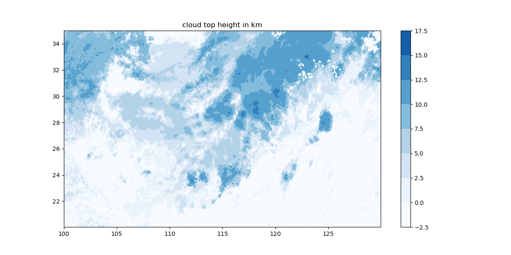
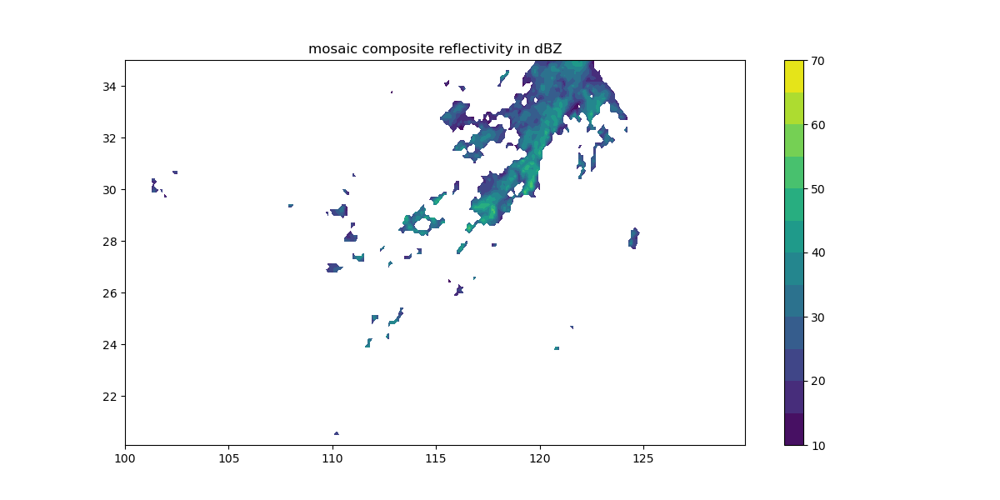
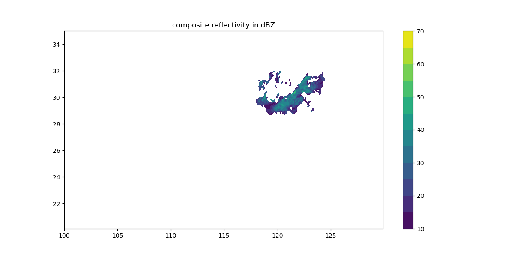
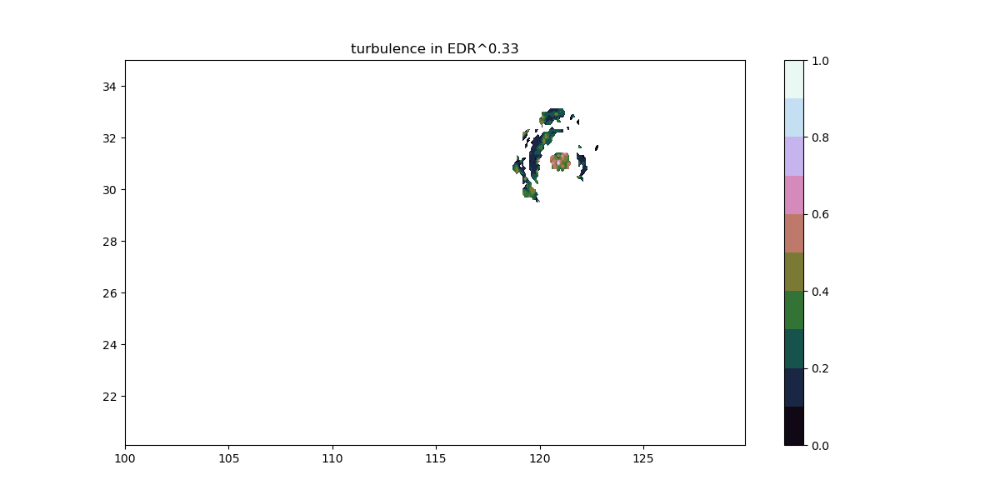
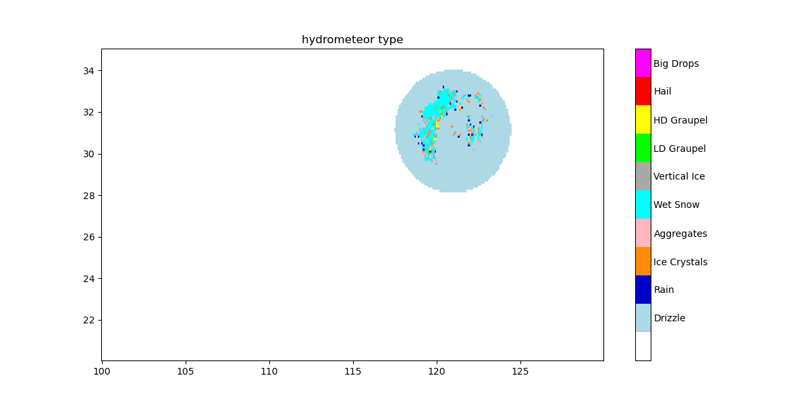
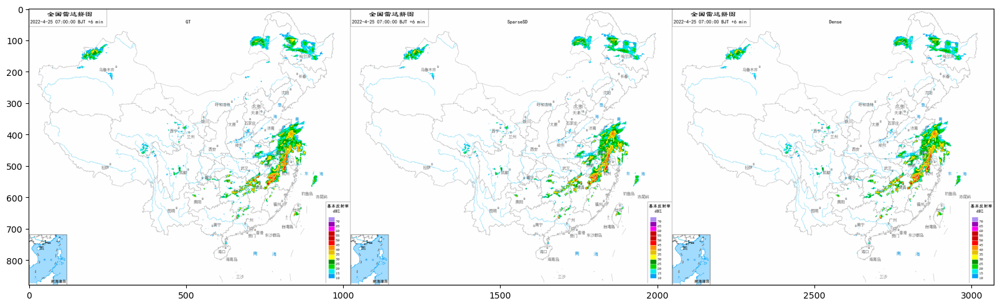
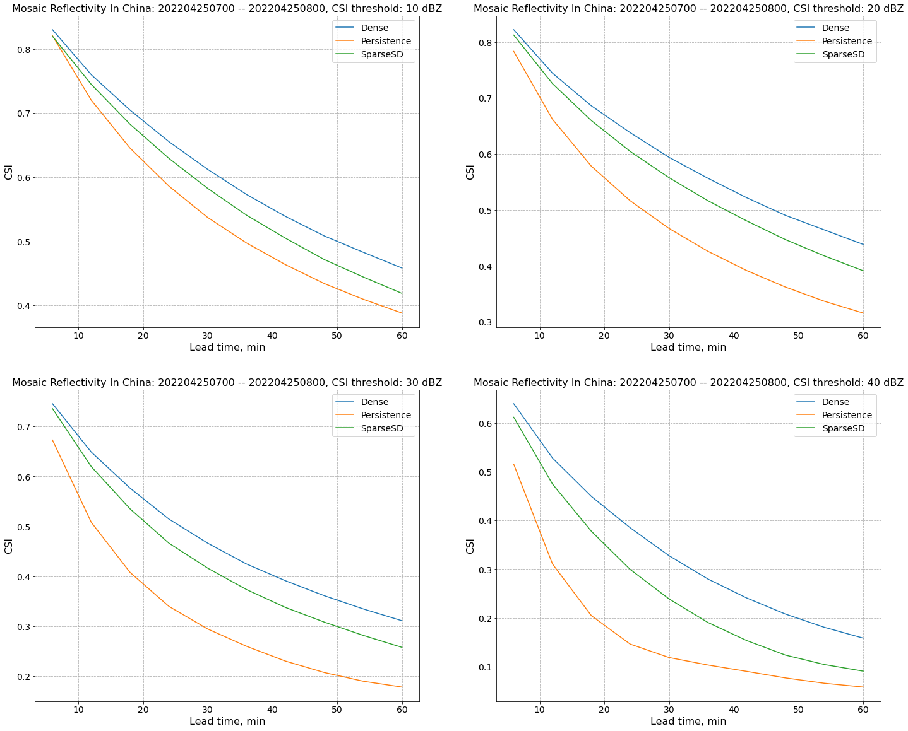

## 1 研究背景

&emsp;&emsp;随着气象观测系统的迅猛发展，利用地面自动气象站、雷达、卫星等获取的观测数据越来越多，多种数值模式模拟数据质量也在不断提高。利用数据融合与数据同化技术，综合多种来源观测资料及多模式模拟数据，获得高精度、高质量、时空连续的多源数据融合气象格点产品是行之有效的手段。多源气象数据融合研究重点是，地面站点观测数据与卫星、雷达等遥感手段获取的面观测数据，不同分辨率面观测数据之间的时、空匹配技术，以及不同观测之间系统性偏差订正技术，多源观测资料融合分析技术等。中外多源数据融合气象格点产品研究成果众多，涉及陆面、海洋、大气多个领域，已在天气、气候研究与业务，防灾、减灾等应用中发挥了重要作用。

&emsp;&emsp;由于观测手段和探测方式的差异，多种气象要素观测在时空分布上不一致，无法满足数据融合的要求。

&emsp;&emsp;因此，研究时空协调一致的高分辨率观测资料的匹配分析技术，构建基于卫星、雷达及其它多源观测数据的三维时空对齐模块，为空-天-地互联气象数据融合提供基础。


## 2 研究方法
&emsp;&emsp;空间对齐即插值到同一网格，插值方法有3种，各自介绍一下优缺点，功能都有可以自行选择；测试时间对比；
先插到等经纬度、再插值到机载网格，因为时间对齐时最好可以关注到比自身更大的区域。

&emsp;&emsp;时间对齐即外推到当前时刻，包括光流法和深度学习。
光流法。
UNet方法。

### 2.1 空间匹配
&emsp;&emsp;空间匹配可以将各资料插值到到统一的网格上。插值指利用已知的点来“猜”未知的点，常见的3种插值方法：
1. **最邻近插值方法（Nearest Interpolation）**
&emsp;&emsp;最近临插值算法的原理是在原图像中找到最近临的一个点，然后把这个点的像素值插入到目标图像中，最近临插值算法优点是算法简单，易于实现，计算速度最快，但是效果最差。
&emsp;&emsp;最近邻法不需要计算新图像矩阵中点的数值，直接找到原图像中对应的点，将数值赋值给新图像矩阵中的点，根据对应关系找到原图像中的对应的坐标，这个坐标可能不是整数，这时候找最近的点进行插值。对应关系如下：
$ \frac{src\_x}{src\_w} = \frac{des\_x}{des\_w} $ 
=> $ src\_x = \frac{des\_x}{des\_w} \times src\_w $
同理，$ src\_y = \frac{des\_y}{des\_h} \times src\_h $
&emsp;&emsp;其中，$src\_x$、$src\_y$为原图像中像素点的x和y坐标，$des\_x$、$des\_y$为目标图像中像素点的x和y坐标，$src\_w$、$src\_h$为原图像的宽度和高度，即x和y方向的格点数，$des\_w$、$des\_h$为目标图像的宽度和高度。
&emsp;&emsp;举个例子，假设原图像是一个1行3列的数组[10, 15, 20]，插值为1行4列的src_x为```[0, 1, 2, 3]/4*3```，即[0, 1, 2, 2]，插值后图像为[10, 15, 20, 20]。
&emsp;&emsp;可见，最近邻法不需要计算，只需要寻找原图中对应的点，所以最近邻法速度快。但是会破坏原图像中像素的渐变关系，原图像中的像素点的值是渐变的，但是新图像中局部破坏了这种渐变关系。
2. **[双线性插值法（Bilinear Interpolation）](https://zhuanlan.zhihu.com/p/110754637)**
&emsp;&emsp;由原图像中4 ($2 \times 2$)个点计算新图像中1个点，在很多框架中属于默认算法。其核心思想是在两个方向分别进行一次线性插值。
&emsp;&emsp;邻近点的对应公式与最近邻法一样，不一样的是根据对应关系不再是找最近的1个点，而是找最近的4个点，如图中$Q_{11}(x_1, y_1), Q_{12}(x_1, y_2), Q_{21}(x_2, y_1), Q_{22}(x_2, y_2)$。而后由$Q_{12}, Q_{22}$用线性插值法插值出$R_2$，由$Q_{11}, Q_{21}$插值出$R_1$，再由$R_1$和$R_2$插值出P点的数值。

- 先进行x方向的线性插值：
$ R_1(y_1固定): f(x,y_1) = \frac {x_2 - x}{x_2 - x_1}f(Q_{11}) + \frac {x - x_1}{x_2 - x_1}f(Q_{21}) $
$ R_2(y_2固定): f(x,y_2) = \frac {x_2 - x}{x_2 - x_1}f(Q_{12}) + \frac {x - x_1}{x_2 - x_1}f(Q_{22}) $
- 再进行y方向的线性插值：
$ P(x固定): f(x, y) = \frac {y_2 - y}{y_2 - y_1}f(x, y_1) + \frac {y - y_1}{y_2 - y_1}f(x, y_2) $ 
代入x方向的公式以及$x_2 - x_1 = 1, y_2 - y_1 = 1$得：
$ f(x,y) = (y_2 - y)(x_2 - x)f(Q_{11}) + (y_2 - y)(x - x_1)f(Q_{21}) + (y - y_1)(x_2 - x)f(Q_{12}) + (y - y_1)(x - x_1)f(Q_{22}) $
可以写成：$ f(x,y) = w_{11}f(Q_{11}) + w_{21}f(Q_{21}) + w_{12}f(Q_{12}) + w_{22}f(Q_{22}) $。其中，每个点的权重都与目标点和对角点的距离有关。
3. **[三次样条插值（Spline Interpolation）](https://blog.csdn.net/daduzimama/article/details/90477388)**
&emsp;&emsp;用分段函数插值，既能穿过所有已知点，又能避免龙格现象（剧烈的震荡）。
&emsp;&emsp;但是分段函数之间彼此衔接不好怎么办？
&emsp;&emsp;答案是，高次样条插值。即每个分段函数都采用高次函数形式来构造（三次样条插值就是用x的三次方形式构造），这就保证了多个函数之间的衔接光滑。（注：不能用过高阶的函数，否则抖动太剧烈。）
&emsp;&emsp;三次样条插值就是把已知数据分割成若干段，每段构造一个三次函数，并且保证分段函数的衔接处具有0阶连续，一阶导数连续，二阶导数连续的性质（也就是光滑衔接）。
### 2.2 时间对齐
&emsp;&emsp;时间对齐指的是根据过去时刻的数据外推到目标时刻，常见的方法包括传统光流外推算法和机器学习。
**2.2.1 光流法**
&emsp;&emsp;基于雷达的降水邻近预报技术可以分为3类：1. climatological persistence，用气候平均或中值进行外推预；2. Eulerian persistence， 用最新可获得的观测作为预测，因此预测结果与lead time无关；3. Lagrangian persistence，假设降水强度和运动场持续存在，对最近时刻的观测场进行外推。也可以按照预报不确定性进行分类：1. 确定性方法；2.ensemble方法（通过ensemble来考虑预报不确定性）。研究主要是围绕确定性降水预报的拉格朗日持久性模型Lagrangian persistence models的开发。

&emsp;&emsp;拉格朗日方法包括两个计算步骤：跟踪tracking和预测forecasting/extrapolation。tracking：以每个像素或连续的物体为基础从一系列连续的雷达图像中计算出一个速度场。forecasting：使用该速度场对最近的降水进行平移。这一步是基于半拉格朗日方案（Germann和Zawadzki，2002）、插值程序（Liu等人，2015）或基于网格的模型（Bellerby，2006；Zahraei等人，2012）实施的。利用不同的tracking和extrapolation算法，还可以生成一个ensemble forecast。

&emsp;&emsp;Tracking主流的技术之一被称为 “光流”（optical flow）。最初的术语是受摄像机或眼球相对于物体移动时观察到的亮度模式的明显运动的启发（Horn和Schunck，1981）。今天，光流通常被理解为一组从连续图像帧中推断运动模式或速度场的技术，例如在降水预报领域。对于速度场的估计，我们需要同时接受亮度恒定的假设和一组额外的光流约束（OFCs）之一。OFC对应着两大类光流模型：局部（差分）和全局（变分）。局部模型试图只在某些邻域设置OFC，而全局模型则对整个图像应用OFC。还有一组独特的光谱方法，其中傅里叶变换被应用于输入，在光谱（傅里叶）域解决OFC（Ruzanski等人，2011）。

&emsp;&emsp;rainymotion库是一套定量降水估计的benchmark程序，公开、透明、可重复和易于使用。其中包括两套tracking模型：Sparse(Lucas and Kanade, 1981)和Dense(Kroeger et al., 2016) ，同时，两类外推技术分别是基于图像扭转（image warping）和空间插值。研究基于rainymotion库实现各雷达回波及卫星云图的外推。关于rainymotion的方法整理在《光流法降水外推开源库：rainymotion》。

**2.2.1 深度学习方法 -- 以UNet为例**


## 3. 程序说明
### 3.1 数据结构

&emsp;&emsp;整个工作流的模块分解：


&emsp;&emsp;融合的数据对象结构示意如下图所示。



&emsp;&emsp;其中，对象FusionData包含的参数有起止时间、目标经纬度范围extend_ll、目标网格分辨率resolution、数据来源data_type、基于雷达基数据希望获得哪些变量wsr98d_fields_add，FusionDS是存储的插值到等经纬度网格上的各类气象数据。
&emsp;&emsp;目前已包括的数据类型有卫星、雷达基数据、全国雷达拼图，已支持的变量有雷达反演的诊断量如湍流、组合反射率、冰晶冰雹，卫星的各类3级产品，如云掩膜、云顶高度、闪电等。
### 3.2 空间对齐效果
&emsp;&emsp;以2022年4月25日06时为例，统一插值到经纬度范围(20-35 100-130 E）的云顶高度、雷达拼图、单站组合反射率、湍流、极化量估计出的水凝物类型示意图如下：






对齐到机载网格的示意图如下：

### 3.3 时间对齐效果
&emsp;&emsp;以雷达拼图光流法外推为例进行展示：



## 小结
已有结果：
存在问题：
还需进一步细化：

### 代码实现
1. 空间对齐的插值部分：
1.1 插值到等经纬度时使用scipy.interpolate.[griddata](https://docs.scipy.org/doc/scipy/reference/generated/scipy.interpolate.griddata.html#scipy.interpolate.griddata)()函数实现。
griddata(points, values, xi, method='linear', fill_value=np.nan, rescale=False):
用途：对D维的数据进行插值。
参数：
-- points：已知的数据点坐标。可以是（n，D）的数组，也可以是1D数组的元组，(n,)。
-- values：已知点对应的值，1维ndarray(float型或复数)，（n，）。
-- xi： 插值的目标网格。（M，D）的二维数组（浮点数），或一维数组的元组，形状插值数据的点。
-- method：插值方式。
&emsp;&emsp;-- nearest 返回最接近插值点的数据点的值。
&emsp;&emsp;-- linear 将输入点设置为n维单纯形，并在每个单形上线性插值。
&emsp;&emsp;-- cubic 三次样条插值。
1.2 插值到机载雷达视角使用get_ac函数实现。
get_ac(ac_parameters, var, lat, lon):
用途：基于载机参数，将数据插值到与机载雷达的网格中。
参数：
-- ac_parameters：字典，包含最小最大探测距离、探测角度范围、载机经纬度（是否是度分秒的形式）、朝向、距离门的分辨率。
-- var: 2D数组，插值前数据。
-- lat, lon: 2D数组，插值前的经纬度网格。
2. 时间对齐中光流法的代码及其说明整理在《extrapolation_china.ipynb》或《.pdf》。